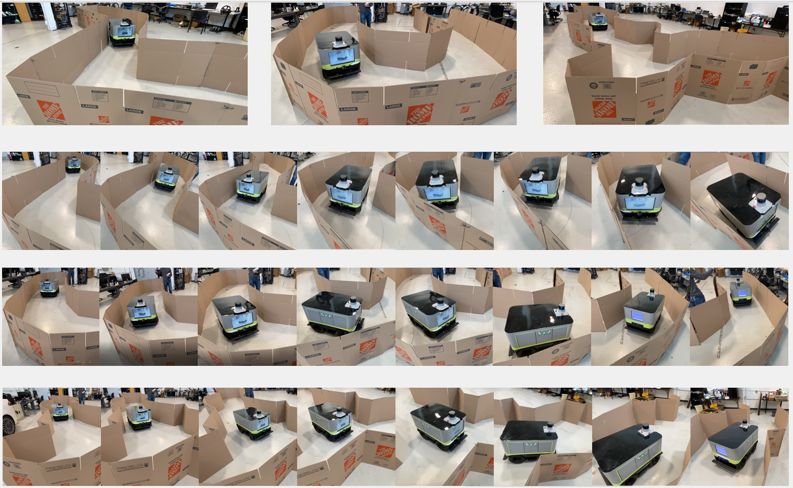

# Reinforcemen Learning with ROS/Gazebo Guidance 

## Old repo for PPO and PPO-discrete
[DQN, DDPG, SAC, PPO, PPO-discrete implementation](https://github.com/Zhaofeng-Tian/RL-Narrow-Space-Exploration)

## Welcome to cite the paper below if this project helps.
`@INPROCEEDINGS{9844904,
  author={Tian, Zhaofeng and Shi, Weisong},
  booktitle={2022 Fifth International Conference on Connected and Autonomous Driving (MetroCAD)}, 
  title={Design and Implement an Enhanced Simulator for Autonomous Delivery Robot}, 
  year={2022},
  volume={},
  number={},
  pages={21-29},
  doi={10.1109/MetroCAD56305.2022.00009}}`

## RL_ROS  python3 package introduction
This is an python3 package for reinforcement learning ros/gazebo environment building, which enables users to control gazebo world reset, get laser, camera, odom info from gazebo world using python codes. The package is based on [openai_ros](https://theconstructcore.bitbucket.io/openai_ros/index.html) but makes it competible for python3 & Tensorflow 2.0+ and more compact, easier for beginners.

 

Related papers: [Narrow Space RL Exploreation](), [ZebraT Gazebo Simulator](https://arxiv.org/pdf/2205.07944.pdf). Welcome to cite them if this guidance is useful to you.
## Build your python3 tensorflow2 environment
First, build python3 env using virtualenv

`virtualenv -p python3 your_env_name` 

then activate it to verify it is built successfully:

`source ~/your_env_name/bin/activate` 

`pip install ... ` to install all the python packages you need like tensorflow. In my case, my python version is 3.6.9 (default python3 version in Ubuntu 18.04), and my tf version is `tensorflow-gpu 2.4.0`, which matches my CUDA version and cudatookit version. Please refer to tensoflow official guidance to download a correct gpu version that is competible to your CUDA and cudatookit version. To check if your gpu can be recognized by tf, `tf.test.is_gpu_available()`.

## Build your python3 ROS workspace

Second, build your workspace compiling with python3 and meanwhile compile
the tf2_ros with python3. (tf2_ros was originally compiled with python2, 
so if you do not compile tf2_ros, it could cause issues)

`sudo apt update` 
`sudo apt install python3-catkin-pkg-modules python3-rospkg-modules python3-empy` 

prepare workspace:

`mkdir -p ~/your_ws/src; cd ~/your_ws` 
`catkin_make` 
`source devel/setup.bash` 
`wstool init` 
`wstool set -y src/geometry2 --git https://github.com/ros/geometry2 -v 0.6.5` 
`wstool up` 
`rosdep install --from-paths src --ignore-src -y -r` 

compile workspace for Python3

`catkin_make --cmake-args \` 
`            -DCMAKE_BUILD_TYPE=Release \` 
`            -DPYTHON_EXECUTABLE=/usr/bin/python3 \` 
`            -DPYTHON_INCLUDE_DIR=/usr/include/python3.6m \` 
`            -DPYTHON_LIBRARY=/usr/lib/x86_64-linux-gnu/libpython3.6m.so` 

## Download rl_ros package for python/Gazebo connection
Execute the following commands: 
`cd ~/your_ws/src` 
`git clone https://github.com/Zhaofeng-Tian/rl_ros.git` 
`cd ~/your_ws` 
`catkin_make -j4` 
`source devel/setup.bash` 
`rosdep install rl_ros` 

## Download ZebraT robot gazebo model (You can use your own model in the same way)
`cd ~/your_ws/src` 
`git clone https://github.com/Zhaofeng-Tian/ZebraT-Simulator.git` 
To use your model, refer to ZebraT model, you may need to build your worlds and make robot urdf file available, and also have two launch files that resemble `load_env.launch` and `put_robot_in_world.launch` in my ZebraT launch folder. After that you need to configurate envs and algorithms to your model by changing all the related parameters in `ROSLauncher` (defined in rl_ros.registration and used in envs files), so that the env could find your robot model and launch your designed world as well.

## Envs and Algorithms
Envs and RL algorithms are stored in folder "envs" and "algorithms", you need to DIY a little for your own applications.
For quick test, do:

`roslaunch rl_ros sac.launch` 

and don't forget to change possible path variables to your local machine's path.
